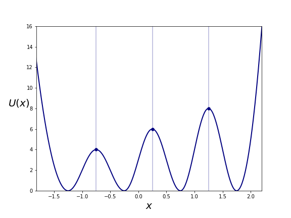
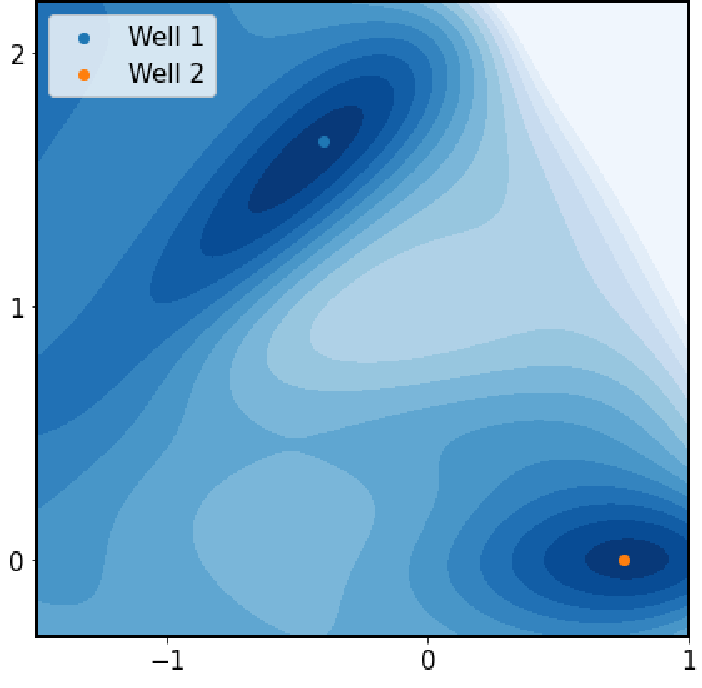

<br />
<div align="center">
    
  

<h3 align="center">Replica Exchange With Non-Equilibrium Switches</h3>

  <p align="center">
    An enhanced-sampling algorithm that increases acceptance probability by perfomring non-equilibrium work simulations.
    <br />
  </p>
</div>


<!-- TABLE OF CONTENTS -->
<details>
  <summary>Table of Contents</summary>
  <ol>
    <li>
      <a href="#about-the-project">About The Project</a>
    </li>
    <li>
      <a href="#getting-started">Getting Started</a>
    </li>
    <li><a href="#systems">Systems</a></li>
    <li><a href="#license">License</a></li>
    <li><a href="#acknowledgments">Acknowledgments</a></li>
  </ol>
</details>


<!-- ABOUT THE PROJECT -->
## About The Project

RENS, or Replica Exchange with Non-equilibrium Switches, is an enhanced sampling algorithm that helps speed up convergence in Replica Exchange dynamics, by performing work simulations in between canonical sampling of the individual replicas.

This repository is an extension of the original work by Prof. Jarzynski and Dr. Ballard, ["Replica Exchange with Non-Equilibrium Switches"](https://www.pnas.org/content/106/30/12224). Besides performing RENS simulations, this module can help perform standard canonical or microcanonical simulations on a model system as well.

[Here](https://pubs.aip.org/aip/jcp/article-abstract/157/18/184102/2841995/Enhanced-sampling-using-replica-exchange-with?redirectedFrom=fulltext) is the paper that was published alongside this work.

<p align="right">(<a href="#top">back to top</a>)</p>


<!-- GETTING STARTED -->
## Getting Started

* Clone the repository : 
    ```
    git clone https://github.com/shaunak-badani/RENS-CPP.git
    ```
* Compile the module:
    ```
    mpic++ *.cpp -o rens
    ```

* Run the executable, with default parameters:
    ```
    mpirun -np 1 ./rens
    ```

* This creates a directory `currentRun/`, and the folder contains the details of the simulation that was performed.

### Optionally, you can pass custom parameters to the module

* Copy the following into a file `nve.json` : 
    ```
    {
        "num_particles": 10,
        "num_steps": 10000,
        "run_type": "nve",
        "files" : "."
    }
    ```

* Run the executable,
    ```
    mpirun -np 1 ./rens nve.json
    ```

* The folder contains the following files : 

    ```tree
    currentRun/
    |-- end.rst
    |-- exchanges.txt
    |-- p.txt
    |-- scalars.txt
    `-- v.txt

    ```

## Systems 

The module implements a couple of interesting toy systems on which MD is performed. 


###  1-Dimensional Leach

This system contains a single particle moving in 1 direction, along the x-axis. It is a continuous version of the potential function as described in chapter 13 of Leach. Its potential, at any given point, is calculated using the graph below : 

 

This graph has three local minima, transitions between which are of great interest in studying Molecular Dynamics Algorithms.

If a system were to include multiple particles at once, they would be considered non-interacting particles, and the potential energy of the system would be the sum of potential energies of all particles on the surface.

### Modified 2-Dimensional Muller Brown Potential

The Muller Brown potential is a combination of multiple gaussians in the 2-D plane. We ran RENS on a slightly modified Muller Brown Potential system, more details can be found in the paper. It's potential energy surface, looks like so:




There are two valleys separated by an energy barrier, which again makes this system of great interest.

<!-- CONTRIBUTING -->
## Contributing

Contributions are what make the open source community such an amazing place to learn, inspire, and create. Any contributions you make are **greatly appreciated**.

If you have a suggestion that would make this better, please fork the repo and create a pull request. You can also simply open an issue with the tag "enhancement".
Don't forget to give the project a star! Thanks again!

1. Fork the Project
2. Create your Feature Branch (`git checkout -b feature/AmazingFeature`)
3. Commit your Changes (`git commit -m 'Add some AmazingFeature'`)
4. Push to the Branch (`git push origin feature/AmazingFeature`)
5. Open a Pull Request


<!-- LICENSE -->
## License

Distributed under the GNU General Public License. See `LICENSE` for more information.


<!-- ACKNOWLEDGMENTS -->
## Acknowledgments

* `snsinfu's` [Replica Exchange implementation](https://github.com/snsinfu/f95-replica-exchange) which gave inspiration to the REMD implementation in this module.
* sandeshkalantre, for his [Jarzynski repo](https://github.com/sandeshkalantre/jarzynski) which contains computational examples on proving Jarzynski's equality.

